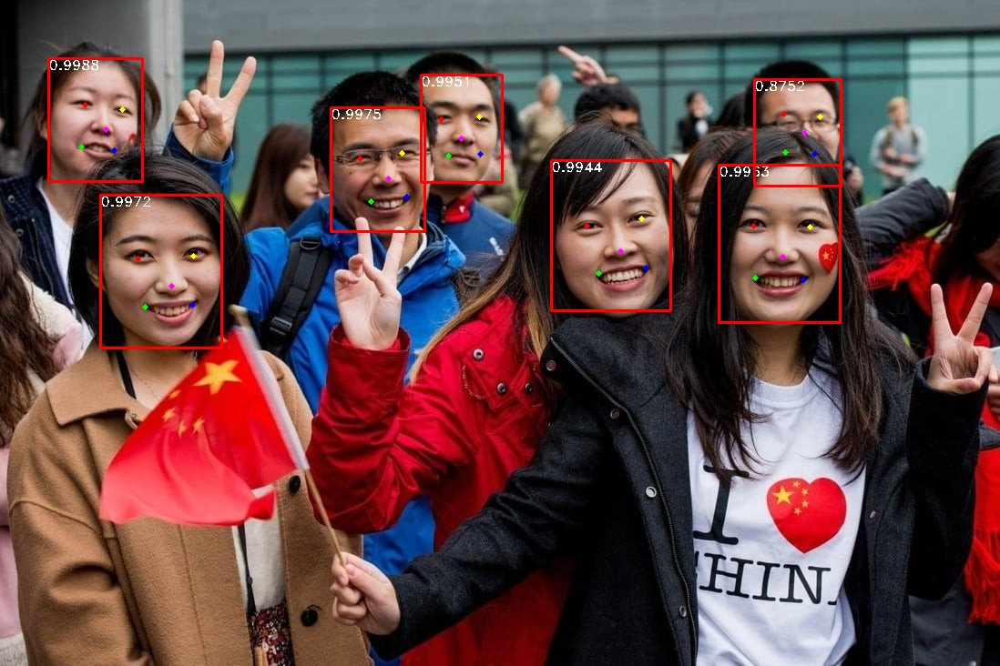
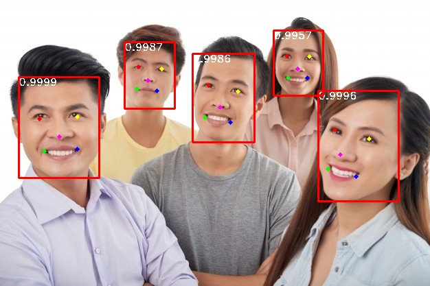

# Face Detection


## Các nội dung chính

- [Chuẩn bị dữ liệu huấn luyện](#Prepare-Data-Training)
- [Hướng dẫn training](#How-to-training-model)
- [Hướng dẫn đánh giá kết quả](#How-to-evaluate-model)
- [Độ chính xác](#Accuracy)
- [Hướng dẫn sử dụng inference module](#Tutorial-to-use-inference-module)
- [Một số kết quả minh họa](#Result-images)
- [Mã nguồn tham khảo](#reference)
- [Thành viên thực hiện](#Contributor)

## Chuẩn bị dữ liệu huấn luyện

Tải về dữ liệu huấn luyện tại đây [WIDER FACE](http://shuoyang1213.me/WIDERFACE/WiderFace_Results.html) 
<hr/>


Sau khi giải nén ta được folder chứa data có cấu trúc như sau:

`Data train được copy vào folder DATASET`

### **`Folder structure`**

- train

      images
      label.txt

- val

      images
      label.txt


<hr/>


## Hướng dẫn training

- Cài đặt các thư viện cần thiết

```
  pip install -r requirements.txt
```


- Điều chỉnh các tham số cần thiết trong `config/`
```
Global:
  epoch: 100  # Số lượng epoch training
  use_pretrain: True # Có sử dụng pretrain không
  pretrain_path: # Nếu có sử dụng thì điền đường dẫn pretrain
  batch_size: 32  # batch size
  resume_epoch: 0 
  checkpoints: checkpoints/20230226 # Đường dẫn checkpoints


Architecture:

  Backbone:
    name: mobinet_v1
    in_channel: 32
    return_layers: {'stage1': 1, 'stage2': 2, 'stage3': 3}
  Neck:
    name: FPN
  Head:
    name: HeadRetina
    out_channel: 64


Inference:
  load_to_cpu: True
  pretrained_path: checkpoints/iter_8000.pth
  cpu: True
  resize: 1.0
  confidence_threshold: 0.02
  top_k: 100
  variance: [0.1, 0.2]
  save_image: True
  keep_top_k: 100
  nms_threshold: 0.4
  vis_thres: 0.6
  save_dir: outputs/images


ConvertOnnx:
  convert: False
  img_size: 640
  save_onnx: inference/models/20230226


SaveWeight: # Số lượng step để lưu laij checkpoints
  iter: 1000


Criterion:
  num_classes: 2
  overlap_thresh: 0.35
  prior_for_matching: True
  bkg_label: 0
  neg_mining: True
  neg_pos: 7 
  neg_overlap: 0.35
  encode_target: False
  loc_weight: 1.0

Optimizer:
  lr: 0.001
  gamma: 0.1
  momentum: 0.9
  weight_decay: 0.0005
  decay1: 190
  decay2: 220

PriorBox:
  clip: False
  min_sizes: [[16, 32], [64, 128], [256, 512]]
  steps: [8, 16, 32]

Dataloader:
  name: Dataloader
  txt_path: DATASET/widerface/train/label.txt #Đường dẫn label file data cần train
  Preproc:
    rgb_means: [104, 117, 123]
    image_size: 640 # kích thước ảnh đầu vào cua model


```

### run training file
- ```python3 -m trainer.train_retinaface```

- Để training các kiến trúc khác, có thể điều chỉnh đường dẫn config tại dòng `158` trong file `trainer/train_retinaface.py`


## Hướng dẫn đánh giá kết quả

- Nhóm đánh giá kết quả trên tập validation của tập data [WIDER FACE](http://shuoyang1213.me/WIDERFACE/WiderFace_Results.html)

- Điều chỉnh đường dẫn tại dòng `11` trong 

    ```
    testset_folder = "DATASET/widerface/val/images/" # Đường dẫn đến folder chứa ảnh đánh giá
    testset_list = "DATASET/widerface/val/wider_val.txt" # Đường đẫn dến label đánh giá
    save_folder = "evaluation/outputs/widerface_evaluate/widerface_txt/" #Đường đãn để lưu kết quả predict
    ```

- Chạy lệnh: ```python3 -m evaluation.test_widerface```

- Chạy lệnh: ```python3 -m evaluation.evaluation```


## Độ chính xác:

| Datasets         | Backbone | AP (Easy) | AP (Medium)| AP (Hard)  |                                                                                    
|:-----------------|:------------------|:------------|:------------|:------------|
| WIDERFACE    | MobileNetv1        | 0.7890      | 0.6897 | 0.3804|


## Hướng dẫn sử dụng inference moudle


+ Bước 1: Copy weight vao folder `face_det_torch/models`

+ Bước 3: Cập nhật config tại `face_det_torch/configs/face_config.json`
    


```
    from face_det_torch.predict_model FaceDet

    face_det = FaceDet()

    predicts = face_det.predict(img)
```
    - Đầu vào là một ảnh
    - Đầu ra [[face1, score1], [face2, score2]]. Với face là các khuôn mặt đã được cắt ra, score là độ tin cậy

## Một số kết quả minh họa

<p align="left">


</p>

## Mã nguồn tham khảo

+ [InsightFace](https://github.com/deepinsight/insightface)

## Thành viên thực hiện

+ [Nguyễn Y Hợp](22C15006@student.hcmus.edu.vn)

+ [Nguyễn Đăng Khoa](22C15010@student.hcmus.edu.vn)

+ [Nguyễn Hoàng Linh](22C11009@student.hcmus.edu.vn)
